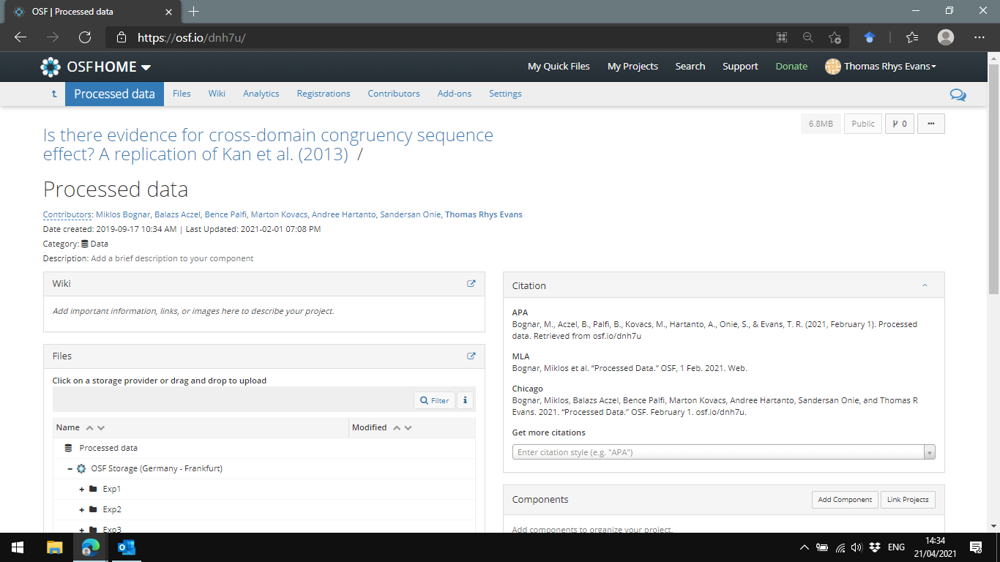

# Making Impact with Open Data

In this brief and final section, we're going to negotiate how to make the most out of having our data being 'open'.

## Citations

One of the easiest things you can do to make your open data accessible and trackable, is to ensure it has a permanent DOI and is therefore citable. You can do this using seperate repositories like figshare.com or publishing the data file within a "component" on the OSF to get a seperate DOI (under the "citation" section). 

For example, data for the project written up here (https://psyarxiv.com/5k8rq/) has been saved in a public component of the wider project page here (https://osf.io/dnh7u/). This means individuals can cite this dataset specifically, which you can then track later! 

### Activity

Spend a few minutes considering how you can make your data citable and trackable. To start, make your project public and prepare a seperate OSF component for the data, with it's own seperate citation. Now take a moment to reflect - Where do I want my data to be accessed from in 10 years? 20 years? Where could and should I share the data to ensure it's longevity?

